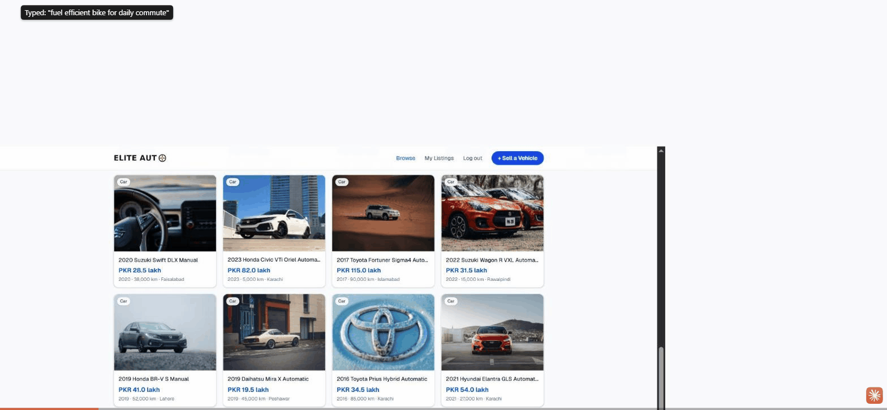
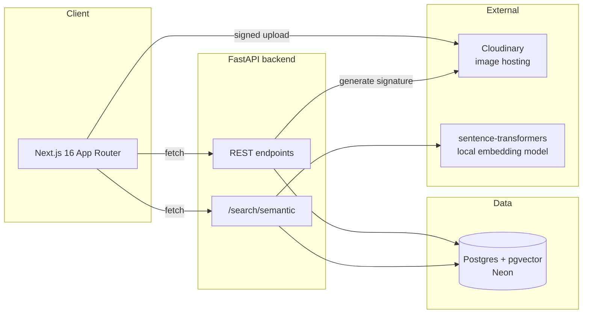

# Elite Auto

**The smartest way to buy and sell used vehicles in Pakistan** — natural language search, verified sellers, and seamless WhatsApp contact.

🔗 **Live demo:** _coming soon — deployment in progress_

> Portfolio project built to demonstrate full-stack engineering — not a real business. No real payments, no real dealer verification, scoped for a focused hiring-manager review rather than production launch.



---

## The idea

Pakistan's used-vehicle market (PakWheels, OLX, Facebook Marketplace, local dealer networks) is split between platforms with trust and volume but weak search, and informal channels with zero structure. None of them let a buyer type "automatic family car under 40 lakh in Karachi" and get back something that actually understands what they mean.

Elite Auto is scoped tightly around proving that one feature — **hybrid semantic search** — rather than trying to rebuild an entire marketplace.

## Architecture



- **Frontend:** Next.js 16 (App Router, Turbopack), Tailwind CSS v4, deployed on Vercel
- **Backend:** FastAPI + SQLModel, deployed on Railway/Render
- **Database:** PostgreSQL with the `pgvector` extension (hosted on Neon), storing both relational listing data and embedding vectors in the same database — no separate vector store
- **Image storage:** Cloudinary, via signed direct-to-cloud uploads (the backend only ever issues a signature; images never pass through the API server)
- **Search:** a local `sentence-transformers` model (`all-MiniLM-L6-v2`) generates embeddings for every listing; natural-language queries are embedded the same way and ranked by cosine similarity, with structured filters (city, price, category) extracted from the query text and applied as hard SQL constraints *before* ranking

## Why these choices

**Next.js over a plain SPA** — App Router gives file-based routing and a clear client/server component boundary without needing a separate routing library; Turbopack keeps the dev loop fast.

**FastAPI + SQLModel over Django/Express** — SQLModel unifies the Pydantic validation layer and the SQLAlchemy ORM layer in one model definition, which matters a lot for a solo project where every duplicate schema is a maintenance cost.

**Postgres + pgvector over a dedicated vector DB (Pinecone, Weaviate)** — the entire dataset is small enough that a dedicated vector store would be pure operational overhead. Keeping embeddings in the same database as the relational data means a single query can join a vector similarity search with normal `WHERE` filters, which is exactly what hybrid search needs.

**Local embedding model over OpenAI's API** — this was a deliberate trade-off, not a default. OpenAI's `text-embedding-3-small` would likely rank results more accurately, particularly for car body-type semantics (see "Known limitations" below). Using a free local model instead removes an external dependency, a billing requirement, and a network round-trip from every search request, at the cost of some ranking precision. For a demo-scale dataset (~30 listings) that trade-off is worth it; swapping in OpenAI embeddings later is a small, isolated change (see `app/core/embeddings.py`).

**Cloudinary over self-hosted storage** — signed direct-to-browser uploads mean the FastAPI server never touches image bytes, which keeps the backend stateless and avoids provisioning object storage for a demo project.

## Known limitations

- **Car search ranking has real noise.** Motorcycle queries (e.g. "cheap fuel efficient bike for daily commute") rank consistently well. Car queries sometimes surface a mismatched body type — e.g. an SUV or an expensive AWD trim ranking above a more literal match for "small economical car for a student." This traces back to the local embedding model not strongly encoding car body-type semantics (sedan vs. SUV vs. hatchback) the way a larger production model would. The hybrid architecture itself (hard filters before ranking) is correct; the remaining noise is model quality, and was accepted as a scoped trade-off — see "Why these choices" above.
- **Stock photography, not real vehicle photos.** Seed listings use Unsplash photos matched by make and category, not actual photos of each specific vehicle — a handful are loosely matched (e.g. a car badge close-up instead of the car itself).
- **Boost Listing is UI-only.** No payment is processed; boosted state is stored in the browser's `localStorage`, not the database.
- **Seller contact number is a placeholder.** The WhatsApp button links to a fixed placeholder number rather than a real per-seller phone number, since phone collection wasn't in scope.

## What I'd add with more time

- Swap in OpenAI (or another production-grade) embedding model behind the same `embed_text()` interface, and re-run the same 5-query eval to measure the actual improvement
- Real seller phone numbers captured at registration, wired into the WhatsApp link
- Favorites (save/unsave a listing) — schema and scoping were planned but cut for time
- Multi-role RBAC / admin moderation queue
- Real payment integration behind the Boost Listing button
- Debounced search-as-you-type instead of submit-to-search

## Local setup

### Prerequisites
- Python 3.12+, Node 20+
- A Postgres database with the `vector` extension available (this project uses [Neon](https://neon.tech), free tier)
- A [Cloudinary](https://cloudinary.com) account (free tier) for image uploads

### Backend

```bash
cd backend
python -m venv .venv
./.venv/Scripts/pip install -r requirements.txt   # or .venv/bin/pip on macOS/Linux
cp .env.example .env   # fill in DATABASE_URL, JWT_SECRET, CLOUDINARY_*
./.venv/Scripts/alembic upgrade head
./.venv/Scripts/uvicorn app.main:app --reload --port 8000
```

Optional — seed realistic demo data:

```bash
./.venv/Scripts/python scripts/seed.py             # ~25 realistic listings
./.venv/Scripts/python scripts/embed_listings.py   # generate search embeddings
```

### Frontend

```bash
cd frontend
npm install
cp .env.local.example .env.local   # set NEXT_PUBLIC_API_URL=http://localhost:8000
npm run dev
```

Visit `http://localhost:3000`.

---

Built solo over ~2–3 weeks as a portfolio project. See [`elite-auto-project-plan.md`](./elite-auto-project-plan.md) for the original scoping and week-by-week plan.
